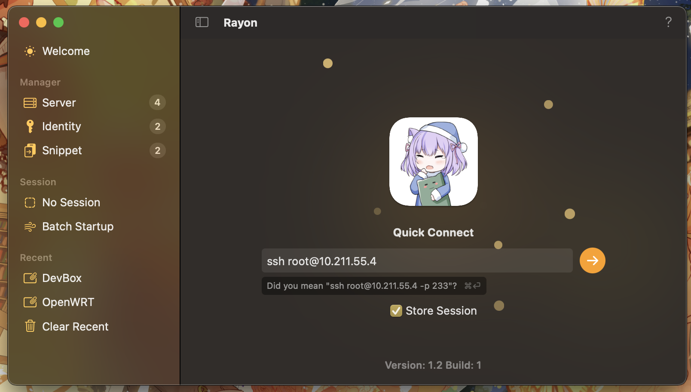
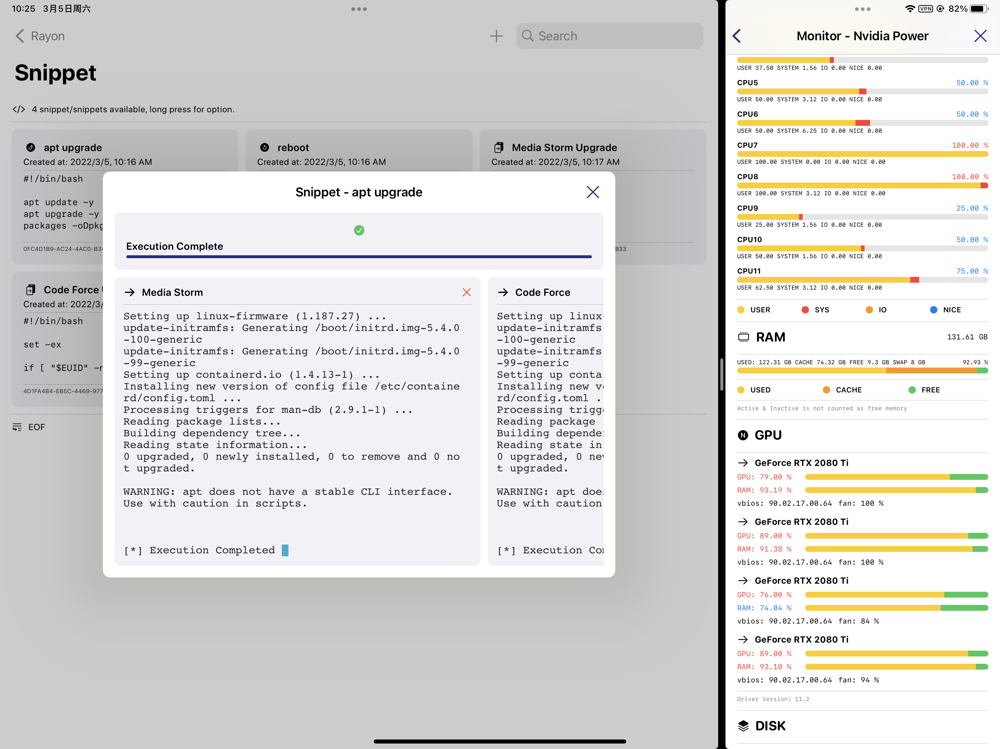

# Rayon

A server monitor tool for linux based machines using remote proc file system with script execution. Available for macOS 12+ & iOS 15+.

## Preview

## Features

- [x] **free and open source**
- [x] libssh2 capable host connections
- [x] Linux proc file system status information
- [x] authenticate with password, key, etc...
- [x] terminal with xterm support
- [x] Port Forward support
- [x] code snippet with batch execution
- [x] Nvidia GPU status monitor
- [x] Running cat for macOS app

## License

[MIT License - Lakr's Edition](./LICENSE)

## Contributor

Made with love by [@Lakr233](https://twitter.com/Lakr233) along with his friends [@__oquery](https://twitter.com/__oquery) [@zlind0](https://github.com/zlind0) [@unixzii](https://twitter.com/unixzii) [@82flex](https://twitter.com/82flex) [@xnth97](https://twitter.com/xnth97) [@misakicoca](https://twitter.com/misakicoca)

---

Copyright © 2022 Lakr Aream. All Rights Reserved.